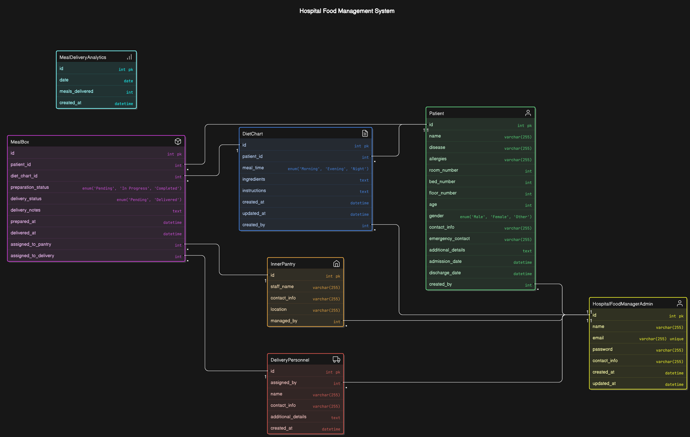

# Hospital Food Delivery Management

### Database Diagram :

  

  

Chayan Mondal
 
Render - server side  
Netlify - client side

const express = require("express");
const { body } = require("express-validator"); // Importing express-validator for validation
const deliveryPerController = require("../controllers/deliveryper.controller"); // Importing controller
const router = express.Router();

// Signup Route with validation
router.post(
"/signup",
[
body("email").isEmail().withMessage("Invalid email address"), // Validate email format
body("password")
.isLength({ min: 6 })
.withMessage("Password must be at least 6 characters long"), // Validate password length
],
deliveryPerController.signupDeliveryPersonnel // Call the controller's signup method
);

// Login Route
router.post("/login", deliveryPerController.loginDeliveryPersonnel); // Call the controller's login method

module.exports = router;
